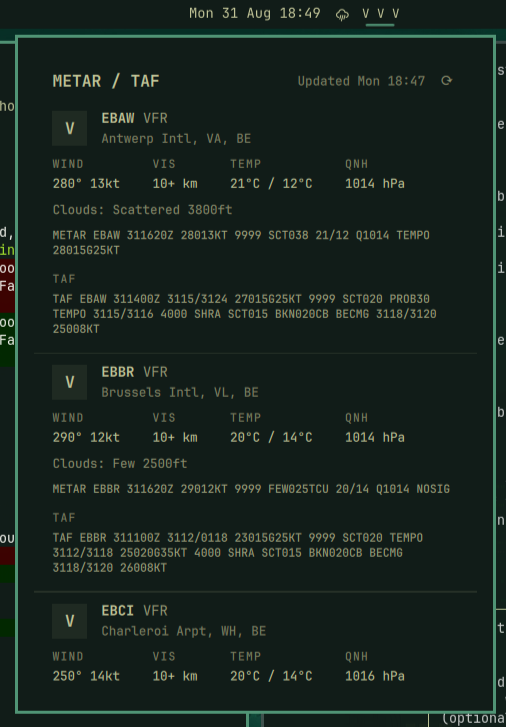

# Aviation Weather (METAR/TAF) — an Omarchy bar plugin

A bar-widget plugin for [Omarchy](https://omarchy.org)'s Quickshell-based
shell (Quattro and later) that shows **aviation** flight-category weather —
**V**FR, **M**VFR, **I**FR, **L**IFR — for a list of airports you configure.
It lives in the bar's center section by default, alongside the clock,
weather, and the other status indicators. Click it for the full picture:
METAR and TAF for every configured station, decoded to plain English by
default (hover to see the raw coded text, or flip the default).

```
Mon 31 Aug 18:06   V V V
```

Click opens a popup with one card per airport — decoded stats, and the
METAR/TAF report itself (coded or decoded, your choice — see below).



## Why letters, not colors

The bar shows plain letters (`V`/`M`/`I`/`L`, plus `–` while refreshing, `…`
while loading for the first time, and `?` for no data — see below) rather
than color-coding by category, so the indicator stays legible and consistent
across themes and doesn't compete with the rest of the bar for visual
weight. The full word (`VFR`, `MVFR`, ...) and station name are in the popup
and in the hover tooltip.

## Coded vs. decoded

Each station's METAR/TAF can be shown as the raw coded text pilots read
(`METAR EBAW 311550Z 27014G25KT 9999 SCT038 21/11 Q1014 NOSIG`) or as a
plain-English sentence built from the same underlying fields. Hovering the
report always shows whichever form isn't currently the primary one, so
neither reading is more than a hover away.

There's no external decode API to lean on for this — checked first:
aviationweather.gov rejects a `units`/`decoded` query parameter outright,
and its JSON/XML responses only ever carry the coded text plus separate
numeric fields, never a narrative string. A capable npm library
(`metar-taf-parser`) exists, but this plugin ships as flat files that
`omarchy plugin add` git-clones straight onto people's machines with no
`npm install` step, and runs unsandboxed inside their shell — so pulling in
a third-party dependency here would mean everyone installing this plugin is
also trusting that dependency's code, for a feature that's a ~150-line
decoder over fields already parsed in `Model.js`. Decoded to English covers:
wind, visibility, present weather (rain/fog/thunderstorms/...), cloud
layers, temperature/dewpoint, altimeter, and NOSIG/BECMG/TEMPO trend, for
both METAR and each TAF change group.

## Data source

[aviationweather.gov](https://aviationweather.gov)'s public data API — no
API key, no rate-limit surprises for personal use, and it covers ICAO
stations worldwide (not just the US) despite the domain. Flight category is
read straight from the API's `fltCat` field when present, with a fallback
classifier (ceiling/visibility) for the rare station that doesn't report
one, using the official FAA flight-category thresholds (AIM 7-1-7 / 14 CFR
Part 91):

| Category | Ceiling         | Visibility     |
|----------|-----------------|----------------|
| LIFR     | < 500 ft        | < 1 sm         |
| IFR      | 500–999 ft      | 1–<3 sm        |
| MVFR     | 1,000–3,000 ft  | 3–5 sm         |
| VFR      | > 3,000 ft      | > 5 sm         |

Ceiling and visibility are each independently checked; whichever is more
restrictive sets the category (`Model.js`: `classifyFlightCategory`).

**Visibility is parsed from the raw METAR/TAF text, not the API's `visib`
JSON field.** That field re-expresses visibility on the US reportable-miles
scale, which is lossy for anything coded in meters (the ICAO norm outside
North America) — EBAW's raw `9999` (ICAO for "10km or more") comes back from
the API as `"6+"`, which would reconvert to a nonsensical `9.7+ km`. This
plugin instead finds the visibility group in the raw text (for both METAR
and each TAF change group) and converts from there, so what's shown is
exactly what the station transmitted, in its original unit.

**Wind speed always stays in knots** and **cloud base height always stays in
feet AGL** regardless of the unit setting — both are the aviation-standard
units everywhere, metric countries included. The `units` setting only
affects temperature, visibility, and altimeter/QNH.

## No stale data

Aviation weather is hyper-local and changes fast, so this plugin would
rather show nothing than something that might be an hour old and wrong. Two
independent checks feed into that:

- **Reachability** — if a fetch (including its retries) fails outright, the
  affected stations show `?` rather than silently keep displaying whatever
  was last cached.
- **Report age** — even when the fetch itself succeeds, a station's own
  observation time (`obsTime`) is checked against `maxAgeMinutes`. A quiet
  station (equipment fault, no reports outside operating hours, ...) ages
  out on its own schedule, independent of whether aviationweather.gov is
  reachable.

Either way the bar letter becomes `?`, and the popup still shows the
last-known data with an explicit "last observation N ago" banner rather than
hiding it outright — still useful context, just never presented as current.

## Install

```bash
omarchy plugin add https://github.com/e2jk/omarchy-aviation-metar-plugin.git --enable
```

Or by hand, for local development — this repo *is* meant to be cloned or
symlinked straight into place:

```bash
ln -s /path/to/omarchy-aviation-metar-plugin ~/.config/omarchy/plugins/metar-taf
omarchy-shell shell rescanPlugins
omarchy plugin enable metar-taf --section center
```

Saving a `.qml` file under `~/.config/omarchy/plugins/` (symlinks included)
hot-reloads live. **`Model.js` is the exception** — QML caches imported
plain-JS modules independently of the component reload, so a change there
needs `omarchy-restart-shell` to actually take effect, not just
`rescanPlugins`.

## Remove

```bash
omarchy plugin remove metar-taf
```

This deletes `~/.config/omarchy/plugins/metar-taf/` and drops the widget
from the bar layout in `~/.config/omarchy/shell.json`. Nothing else on the
system is touched — no daemons, no other config files.

## Configuration

Set these from Setup → Plugins in the Omarchy menu, or inline in
`~/.config/omarchy/shell.json`:

| Key                        | Type    | Default            | Notes                                                                    |
|-----------------------------|---------|--------------------|---------------------------------------------------------------------------|
| `airports`                  | string  | `EBAW,EBBR,EBCI`   | Comma-separated ICAO codes, in display order                             |
| `units`                     | enum    | `Metric`           | `Metric` (°C, km, hPa) or `Imperial` (°F, mi, inHg) — see units note above |
| `showTaf`                   | boolean | `true`             | Include the TAF under each station's METAR                               |
| `refreshMinutes`            | integer | `10`               | How often to re-fetch (5–60 min)                                         |
| `maxAgeMinutes`             | integer | `40`               | A station's last report older than this is treated as no data (10–180)   |
| `decodeStyle`               | enum    | `Decoded`           | `Decoded` (plain English) or `Coded` (raw text) as the primary view      |
| `showStationNameInTooltip`  | boolean | `true`             | Include the full airport name in the bar's hover tooltip                 |

`allowMultiple` is on, so you can add a second instance of the widget with a
different airport list if you want, e.g. one for home and one for a
cross-country you're planning.

## Interactions

| Action        | Effect                                                          |
|---------------|-------------------------------------------------------------------|
| Left click    | Toggle the detail popup                                         |
| Middle click  | Force a refresh (bar briefly shows `–` while it's in flight)     |
| Right click   | Send a desktop notification with a one-line summary              |
| Hover (bar)   | Tooltip with each airport's full category and (optionally) name  |
| Hover (report)| Reveals whichever of coded/decoded isn't the primary view        |

## Development

`Model.js` is plain, dependency-free JS with a full test suite (`test/`,
using Node's built-in `node:test` — no test framework dependency):

```bash
npm test    # runs the suite, fails if line/branch/function coverage < 100%
```

`npm install` wires up a `pre-push` git hook (`scripts/git-hooks/pre-push`)
that runs the same suite and blocks the push if it fails. It currently takes
well under a second, so it's a hard gate rather than advisory; if the suite
ever grows slow enough to be friction, that's worth revisiting rather than
just dropping the check.

The QML files (`BarWidget.qml`, `Panel.qml`) aren't covered by automated
tests — there's no QML test harness set up for this repo. Changes there are
verified by hand: symlink into `~/.config/omarchy/plugins/metar-taf`,
`omarchy-shell shell rescanPlugins` (`.qml` changes) or
`omarchy-restart-shell` (`Model.js` changes — QML caches imported JS modules
independently of the component reload), and check `journalctl --user -b`
for QML warnings.

## License

MIT — see [LICENSE](LICENSE).
